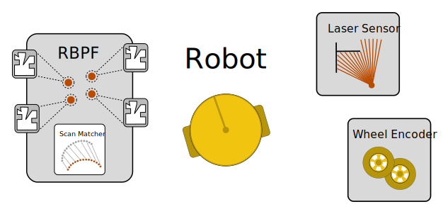

# Occupancy Grid FastSLAM
A FastSLAM algorithm for Occupancy Grid Maps based on Rao-Blackwellized Particle Filters

1. [Consume](#consume)
2. [Introduction](#introduction)
3. [Implementation Details](#implementation-details)
   1. [Robot](#robot)
   2. [Rao-Blackwellized Particle Filter](#rao-blackwellized-particle-filter)
       1. [Particles](#particles)
       2. [Scan Matcher](#scan-matcher)
   3. [Sensor](#sensor)
   4. [Wheel Encoder](#wheel-encoder)
4. [References](#references)

## Consume

#### To run Simulator and FastSLAM

```bash
$ cargo run --bin vacuum-robot-simulator -- simulator/worlds/house.svg
```

## Introduction

This repository presents a simulation environment for a differential drive robot along with an implementation of a FastSLAM algorithm for Occupancy Grid Maps based on Rao-Blackwellized Particle Filters. The FastSLAM algorithm is inspired by [Improved Techniques for Grid Mapping with Rao-Blackwellized Particle Filters](http://ais.informatik.uni-freiburg.de/publications/papers/grisetti07tro.pdf) and the implementation is largely based on the algorithms presented in [Probabilistic Robotics](http://www.probabilistic-robotics.org).
The simulator can be used in three different modes:

1. Localization (work in progress)
2. Mapping (work in progress)
3. SLAM (work in progress)

In Localization mode, a ground truth map of the area is provided and the robot is tasked with localizing itself relative to this map. Mapping is performed given ground truth information about the pose of the robot and a map is constructed from the robot's sensor readings. In SLAM mode, no ground truth information is used at all and the robot has to solve the problem of simulatenously localizing itself while constructing a map of its surroundings.


## Implementation Details

An illustration of the main components is displayed below.

<p align="center">
  
</p>

### Robot 

The robot class serves as an abstraction for most of the computations as it takes all of the components a real-world robot would have as member variables. This includes the sensor, the particle filter and the wheel encoder. This nested structure allows us to expose only relevant information, in this case the current robot pose, to the rest of the program. The robot class further provides a '''drive()''' function in order to simulate the robot motion.

### Rao Blackwellized Particle Filter

The particle filter object implements all functions required for the localization of the robot and the mapping of the environment. This includes the prediction step based on a motion model and odometry information, the particle weighing according to a gaussian measurement model as well as the resampling of the particles. Contrary to most existing particle filter-based SLAM approaches, the proposal distribution is computed not only from the odometry information, but incorporates the robot's current sensor readings as well. This functionality is implemented in the particle filter's scan matcher object.

#### Particles

The concept of SLAM algorithms based on particle filters makes us of a factorization of the posterior distribution of pose and map estimate. This factorization allows us to treat the SLAM problem as isolated localization and mapping problems. Consequently, a set of particles is used to approximate the posterior distribution of the robot pose. Each particle carries a map estimate which is updated individually given the particle's pose. This procedure is known as Mapping with known poses and can be computed efficiently. However, for a large number of particles, retaining individual maps results in high memory consumption and increased computational complexity. Thus, we aim to improve the quality of the proposal distribution in order to be able to keep the required number of particles sufficiently small.

#### Scan Matcher

in short: Scan-matching tries to incrementally align two scans or a map to a scan, without revising the past/map.


The scan matcher is to be seen as an additional component that ensures high-quality proposal distributions form which we sample the set of particles. Instead of relying solely on the usually rather uncertain odometry information, we incorporate the robot's lastest sensor readings into the computation. The scan matcher class implements an Iterative Closest Point matching algorithm that takes as an input the real laser scans as well as a set of estimated laser scans from the current map estimate and outputs a translational vector corresponding to the offset between the two scans. This pose correction can be used to improve the estimate of the particle's pose obtained from the prediction step.


### Sensor

The robot is equipped with a 2D laser range finder. The simulation parameters allow for specifying different FoVs, ranges and resolutions to suit the task at hand as well as the available computational resources. Sensor measurements are simulated by computing the intersection of the laser beams with the line segments that represent the walls of the area. To model measurement noise, white noise of specified variance is applied to the measurements. 

### Wheel Encoder

Wheel encoders are a popular sensor modality to obtain odometry information for autonomous mobile robots. Each accumulating the encoder ticks, the number of wheel revolutions can be estimated and transformed into estimates of translational and angular velocity. This information, combined with the motion model of the robot, is then used in the prediciton step of the particle filter. However, due to unmodeled effects such as wheel slip, encoder-based odometry information is prone to inaccuracies.


## References
[1] Thrun et.al., Probabilistic Robotics. See resources folder.

[2] Dr.Cyrill Stachniss, Robot Mapping course, University of Freiburg. https://www.youtube.com/watch?v=3Yl2aq28LFQ&index=15&list=PLgnQpQtFTOGQrZ4O5QzbIHgl3b1JHimN_

[3] Dr.Cyrill Stachniss, Improved Techniques for Grid Mapping with Rao-Blackwellized Particle Filters.
    http://ais.informatik.uni-freiburg.de/publications/papers/grisetti07tro.pdf